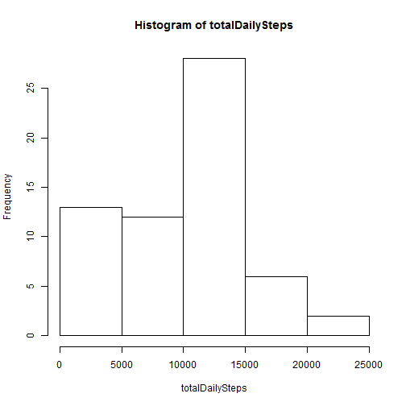
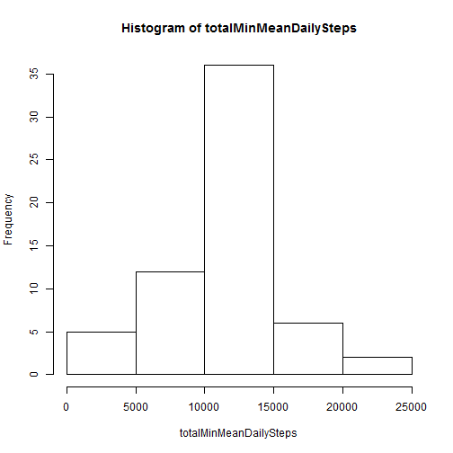
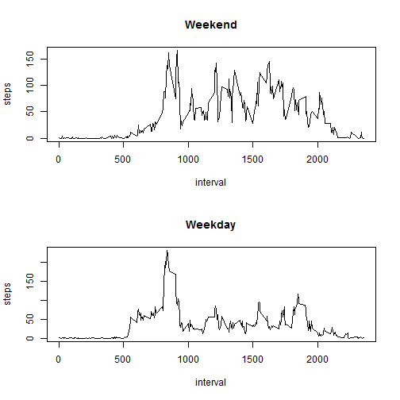

```r
setwd("C:/Users/chad/SkyDrive/Documents/Coursera/RepResearch-Assignment1")
activity <- read.csv("activity.csv")
```


What is mean total number of steps taken per day?

```r
tapply(activity$steps, activity$date, FUN = mean, na.rm = T)
```

```
## 2012-10-01 2012-10-02 2012-10-03 2012-10-04 2012-10-05 2012-10-06 
##        NaN  0.4375000 39.4166667 42.0694444 46.1597222 53.5416667 
## 2012-10-07 2012-10-08 2012-10-09 2012-10-10 2012-10-11 2012-10-12 
## 38.2465278        NaN 44.4826389 34.3750000 35.7777778 60.3541667 
## 2012-10-13 2012-10-14 2012-10-15 2012-10-16 2012-10-17 2012-10-18 
## 43.1458333 52.4236111 35.2048611 52.3750000 46.7083333 34.9166667 
## 2012-10-19 2012-10-20 2012-10-21 2012-10-22 2012-10-23 2012-10-24 
## 41.0729167 36.0937500 30.6284722 46.7361111 30.9652778 29.0104167 
## 2012-10-25 2012-10-26 2012-10-27 2012-10-28 2012-10-29 2012-10-30 
##  8.6527778 23.5347222 35.1354167 39.7847222 17.4236111 34.0937500 
## 2012-10-31 2012-11-01 2012-11-02 2012-11-03 2012-11-04 2012-11-05 
## 53.5208333        NaN 36.8055556 36.7048611        NaN 36.2465278 
## 2012-11-06 2012-11-07 2012-11-08 2012-11-09 2012-11-10 2012-11-11 
## 28.9375000 44.7326389 11.1770833        NaN        NaN 43.7777778 
## 2012-11-12 2012-11-13 2012-11-14 2012-11-15 2012-11-16 2012-11-17 
## 37.3784722 25.4722222        NaN  0.1423611 18.8923611 49.7881944 
## 2012-11-18 2012-11-19 2012-11-20 2012-11-21 2012-11-22 2012-11-23 
## 52.4652778 30.6979167 15.5277778 44.3993056 70.9270833 73.5902778 
## 2012-11-24 2012-11-25 2012-11-26 2012-11-27 2012-11-28 2012-11-29 
## 50.2708333 41.0902778 38.7569444 47.3819444 35.3576389 24.4687500 
## 2012-11-30 
##        NaN
```

Note: Ignoring missing values in the dataset.

Calculate the total number of steps taken per day

```r
totalDailySteps <- tapply(activity$steps, activity$date, FUN = sum, na.rm = T)
totalDailySteps
```

```
## 2012-10-01 2012-10-02 2012-10-03 2012-10-04 2012-10-05 2012-10-06 
##          0        126      11352      12116      13294      15420 
## 2012-10-07 2012-10-08 2012-10-09 2012-10-10 2012-10-11 2012-10-12 
##      11015          0      12811       9900      10304      17382 
## 2012-10-13 2012-10-14 2012-10-15 2012-10-16 2012-10-17 2012-10-18 
##      12426      15098      10139      15084      13452      10056 
## 2012-10-19 2012-10-20 2012-10-21 2012-10-22 2012-10-23 2012-10-24 
##      11829      10395       8821      13460       8918       8355 
## 2012-10-25 2012-10-26 2012-10-27 2012-10-28 2012-10-29 2012-10-30 
##       2492       6778      10119      11458       5018       9819 
## 2012-10-31 2012-11-01 2012-11-02 2012-11-03 2012-11-04 2012-11-05 
##      15414          0      10600      10571          0      10439 
## 2012-11-06 2012-11-07 2012-11-08 2012-11-09 2012-11-10 2012-11-11 
##       8334      12883       3219          0          0      12608 
## 2012-11-12 2012-11-13 2012-11-14 2012-11-15 2012-11-16 2012-11-17 
##      10765       7336          0         41       5441      14339 
## 2012-11-18 2012-11-19 2012-11-20 2012-11-21 2012-11-22 2012-11-23 
##      15110       8841       4472      12787      20427      21194 
## 2012-11-24 2012-11-25 2012-11-26 2012-11-27 2012-11-28 2012-11-29 
##      14478      11834      11162      13646      10183       7047 
## 2012-11-30 
##          0
```

If you do not understand the difference between a histogram and a barplot, research the difference between them. Make a histogram of the total number of steps taken each day

```r
hist(totalDailySteps)
```

 


Calculate and report the mean and median of the total number of steps taken per day

```r
mean(totalDailySteps)
```

```
## [1] 9354.23
```

```r
median(totalDailySteps)
```

```
## [1] 10395
```


What is the average daily activity pattern?

Make a time series plot (i.e. type = "l") of the 5-minute interval (x-axis) and the average number of steps taken, averaged across all days (y-axis)


```r
steps <- activity$steps
interval <- activity$interval
activityMeanPerMin <- aggregate(steps ~ interval, FUN = mean, na.rm = T)
plot(activityMeanPerMin, type = "l")
```

 

Which 5-minute interval, on average across all the days in the dataset, contains the maximum number of steps?


```r
print (activityMeanPerMin[activityMeanPerMin$steps == (max(activityMeanPerMin$steps)),], row.names = F)
```

```
##  interval    steps
##       835 206.1698
```


Imputing missing values

Note that there are a number of days/intervals where there are missing values (coded as NA). The presence of missing days may introduce bias into some calculations or summaries of the data.

Calculate and report the total number of missing values in the dataset (i.e. the total number of rows with NAs)

```r
length(activity$steps[is.na(activity$steps)])
```

```
## [1] 2304
```


Devise a strategy for filling in all of the missing values in the dataset. The strategy does not need to be sophisticated. For example, you could use the mean/median for that day, or the mean for that 5-minute interval, etc.

Create a new dataset that is equal to the original dataset but with the missing data filled in.

```r
activityMinMean <- activity

# All NAs
naElements <- which(is.na(activityMinMean$steps))

nalookup <- function(value,lookup) {
  lookup[lookup[1] == value,2]
}

activityMinMean$steps[naElements] <- sapply(activityMinMean$interval[naElements],nalookup, activityMeanPerMin)
```


Make a histogram of the total number of steps taken each day and Calculate and report the mean and median total number of steps taken per day. Do these values differ from the estimates from the first part of the assignment? What is the impact of imputing missing data on the estimates of the total daily number of steps?


```r
totalMinMeanDailySteps <- tapply(activityMinMean$steps, activityMinMean$date, FUN = sum, na.rm = T)
hist(totalMinMeanDailySteps)
```

 

```r
mean(totalMinMeanDailySteps)
```

```
## [1] 10766.19
```

```r
median(totalMinMeanDailySteps)
```

```
## [1] 10766.19
```


Are there differences in activity patterns between weekdays and weekends?

Yes.  The pattern is now a normal distribution where before it was right skewed.  The addition of the means pushed the data  toward more steps per min.

For this part the weekdays() function may be of some help here. Use the dataset with the filled-in missing values for this part.


```r
activityMinMean$DoW <- weekdays(strptime(activityMinMean$date,"%Y-%m-%d"))
```

Create a new factor variable in the dataset with two levels - "weekday" and "weekend" indicating whether a given date is a weekday or weekend day.

```r
activityMinMean$WEndorNot[activityMinMean$DoW == "Saturday" | activityMinMean$DoW == "Sunday"] <- "Weekend"
activityMinMean$WEndorNot[!(activityMinMean$DoW == "Saturday") & !(activityMinMean$DoW == "Sunday")] <- "Weekday"
activityMinMean$WEndorNot <- as.factor(activityMinMean$WEndorNot)
```


Make a panel plot containing a time series plot (i.e. type = "l") of the 5-minute interval (x-axis) and the average number of steps taken, averaged across all weekday days or weekend days (y-axis). See the README file in the GitHub repository to see an example of what this plot should look like using simulated data.


```r
weekend <- activityMinMean[activityMinMean$WEndorNot =="Weekend",]
weekday <- activityMinMean[activityMinMean$WEndorNot =="Weekday",]

weekendagg <- aggregate( steps ~ interval, weekend, FUN = mean, na.rm = T)
weekdayagg <- aggregate(steps ~interval, weekday, FUN = mean, na.rm = T)


par(mfrow= c(2,1))
plot(weekendagg,main="Weekend", type="l")

plot(weekdayagg,main="Weekday", type="l")
```

 


